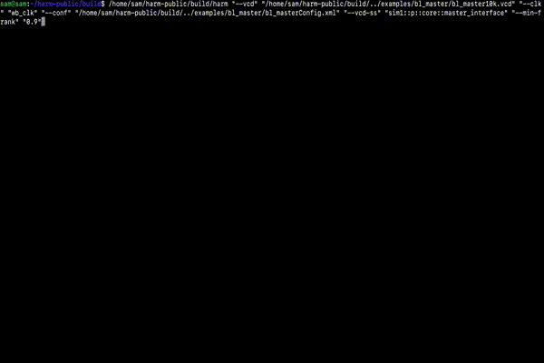

## HARM

The official repo of the Hint-Based AsseRtion Miner


  

## Table of contents

[Project info](#project-info)

[Quick start](#quick-start)
1. [Install dependencies](#dependencies)
2. [Build the project](#build-the-project)
3. [Run default tests](#run-default-tests)

[How to use the miner](#how-to-use-the-miner)
* [Run with vcd trace](#run-with-a-vcd-trace)
* [Run with csv trace](#run-with-a-csv-trace)
* [Automatically generating a configuration file](#automatically-generating-a-configuration-file)

[The configuration file](#the-configuration-file)

[How to check an assertion](#how-to-check-an-assertion)


[Optional arguments](#optional-arguments)

[Logging](#logging)

[Docker](#docker)

[Citations](#citations)

## Project info

HARM (Hint-based AsseRtion Miner) is a tool to generate Linear Temporal Logic (LTL) assertions starting from a set of user-defined hints and the simulation traces of the design under verification (DUV). The tool is agnostic with respect to the design from which the trace was generated, thus the DUV source code is not necessary. The user-defined hints involve LTL templates, propositions and ranking metrics that are exploited by the assertion miner to reduce the search space and improve the quality of the generated assertions. This way, the tool supports the work of the verification engineer by including his/her insights in the process of automatically generating assertions.




# Quick start

For now, we support only Linux and Mac OS (both x86 and arm64) with gcc and clang (c++17) and cmake 3.14+.

## Dependencies
* [spotLTL](https://spot.lrde.epita.fr/install.html)
* [antlr4-runtime](https://www.antlr.org)
* [boost 1.83+](https://boostorg.jfrog.io/artifactory/main/release/1.83.0/source/)

  

* Install all the dependencies manually or simply run the commands below.

### Ubuntu
```
sudo apt-get install -y uuid-dev pkg-config
```

### Third party
* Install all dependencies. All these dependencies will be compiled from source.
* This will not dirty your system, as all the dependencies will be installed in the third\_party directory.

```
cd third_party
bash install_all.sh
```


## Build the project

Create a build directory.
```
mkdir build && cd build
```

Run cmake.

```
cmake -DCMAKE_BUILD_TYPE=Release ..
```

Build all targets: harm and tests.
```
make
```

### Mac OS only
* Install the libraries (specify a proper path using cmake) 
```
make install
```
* Add the libraries to the runtime library path
```
export DYLD_LIBRARY_PATH=<path_to_install_directory>/harm/lib:$DYLD_LIBRARY_PATH
```

## Run default tests

```
ctest -V -R
```


# How to use the miner  
HARM has two main inputs, a trace in the form of a vcd/csv file and a set of hints.
Hints consist of a set of propositions, templates and metrics; they are defined in a separate xml configuration file. 
The user can find several working examples in the "examples" directory.

## Run with a vcd trace

```
./harm --vcd trace.vcd --clk clock --conf config.xml
```

* clock is the signal used to sample time (every posedge).
* config.xml is the configuration file containing propositions and templates.
* Use --vcd-dir <DIRECTORY> to give as input a set of .vcd traces
* IMPORTANT: see the options --vcd-ss and --vcd-r to make harm capture the correct VCD scope and signals

## Run with a csv trace

```
./harm --csv trace.csv --conf config.xml
```
* Use --csv-dir <DIRECTORY> to give as input a set of .csv traces
* Note that you do not have to specify a clock signal when using a csv file, as each row is already considered a clock event.
* A CSV trace must contain the declaration of the design's variables in the first row, following a C/Verilog style.
	
Example of a valid csv file:
```
int var1, bool var2, float var3, logic [3:0] var4
23, 1, 34.7, xxxz
34, 0, 99.912, 0101
```

## Notes on input interpretation

Harm supports the following C and SV (SystemVerilog) variable types: bool, char, short, int, long int, unsigned char, unsigned short, unsigned int, unsigned long int, size\_t, int64\_t, int32\_t, uint64\_t, uint32\_t, float, double, shortint, longint, byte, bit, shortint unsigned, int unsigned, longint unsigned, byte unsigned, bit signed, reg, logic, integer, wire, time, reg signed, logic signed, integer unsigned, wire signed, time signed, shortreal, real, realtime.

When using csv traces, HARM will interpret the input values as: 
* base 10 integers for C integer types and SV 2-value integers; 
* base 2 binaries for SV 4-value bit-vectors (such as wire, reg, logic and int);
For both C and SVA types, if the type is signed, then the input value will be treated as a 2-complement integer.
For base 2 values, it is not mandatory to add leading zeros (on the left side) if the value should be intepreted as unsigned or positive signed.
However, if the value is to be treaded as a signed negative, harm expects to receive the entire binary representation.
For example, for variable declared as "logic signed [7:0] v1", value "100" will be treaded as "00000100" (8-bit), equal to 4 in base 10.
Instead, to specify a negative value, such as -3, harm wants to see the entire binary representation, that is, "11111101" (8-bit).
Harm will print all base 2 constants as integers.


	
## Automatically generating a configuration file
To simplify the creation of a new test, HARM is capable of generating a sample configuration file using the variables found in the trace. The user might want to modify the generated configuration file to adapt it to her/his needs.

For vcd:
```
./harm --vcd trace.vcd --clk clock --conf path/to/newConfig.xml --generate-config
```
For csv:
```
./harm --csv trace.csv --conf path/to/newConfig.xml --generate-config
```

 HARM will create the configuration file on the path given as an argument.

# The configuration file
 It is recommended to always start from an automatically generated configuration file (using the --generate-config option).
 Hints are organised in contexts, each context contains three main types of expressions: propositions, templates and metrics (see the configuration file below).  
 ```xml
<harm>
	<context name="c1">
		<prop exp="var1 && var2" loc="dt"/>
		<prop exp="var3 + var4 > 100" loc="dt"/>
		<prop exp="!var5 || !var6" loc="c"/>
		<prop exp="var10" loc="c"/>
		<prop exp="var11" loc="c"/>
		<numeric clustering="K,10Max,0.01WCSS,><,==,>=,<=" exp="var12" loc="c"/>
		<numeric clustering="K,10Max,0.01WCSS,==" exp="var13" loc="[dt]"/>
		<numeric clustering="K,10Max,0.01WCSS,><,==,>=,<=" exp="var7 + var8" loc="a"/>
		
		<template dtLimits="4A,3D,2D,-0.1E,U,O" exp="G({..#1&..}|-> X(P0)" />
		<template dtLimits="4A,3D,2D,-0.1E,U,O" exp="G({..#1&..}|-> X(P0)" /> 
		
		<filter name="causality" exp="1-afct/traceLength" threshold="0.45"/>
		<sort name="pRepetitions" exp="1/(pRepetitions*2+1)" />
		<sort name="frequency" exp="atct/traceLength"/>
	</context>
</harm>
```
#### Proposition
 Propositions are non-temporal boolean expressions used to fill the empty spots (placeholders) of the templates; metrics are used to perform the final ranking of assertions.

Propositions and metrics can be written using all boolean, relational, arithmetic, bitwise and string operators of the C/C++ language.
All integer variables (defined using C/C++ types) are represented internally as C integers (signed or unsigned, max 64 bits).
All logic variables (defined with Verilog & SV types such as reg, wire or logic) are automatically converted to integers (x,z are converted to 0s, max 64 bit)
All float types are represented internally as C doubles.

For the full grammar of propositions and metrics, check "src/antl4/propositionParser/grammar/proposition.g4".
	
A proposition is defined inside the "exp" attribute
* WARNING: if you are using a vcd trace, the variables must include the hierarchical path as a prefix, ex. "test1::modn::a" is the variable "a" in module "modn" instantiated in module "test1". Check the vcd file to retrieve the path.

* WARNING: if you construct expressions between variables of different types (for example, char and int, or, size\_t and logic), then the usual C/Verilog implicit type conversion rules apply (including the rules for overflows and underflows); see [c-conversion-rules](https://en.cppreference.com/w/c/language/conversion) for more info on this.


#### Numerics
The user can specify a set of numerics to automatically generate propositions (using a clustering algorithm) predicating over arithmetic expressions, like c==ne, c>= ne, c<= ne, c\_l<= ne <= c\_r, with c, c\_l, c\_r representing constants of numeric type, and ne indicating numerical expressions involving the trace variables.
* The "exp" attribute specifies numeric expression (int, logic or double)
* The "clustering" attribute allows to customize the generation of propositions. It contains a comma-separated list of clustering options (all the options can be defined in any order).
  The available options are:
 	* K : use the Kmeans algorithm
 	* \<number\>E : exclude \<number\> from the values used to perform the clustering (this option can be specified multiple times with different values). WARNING: \<number\> must be a base-10 integer or float (even if the numeric expression is of logic type).
 	* \<N\>Max : keep only the top N (using support) generated propositions
 	* \<Float\>WCSS : when using Kmeans, stop the elbow method when the reduction of variance is below the specified percentage (a number between 0 and 1)
  	* == : generate propositions of the form \<numeric-exp\> == c
 	* \>= : generate propositions of the form \<numeric-exp\> \>= c
 	* \<= : generate propositions of the form \<numeric-exp\> \<= c
 	* \>\< : generate propositions of the form lr \<= \<numeric-exp\> \<= cr	 	 
 

See the paper below to know more about how the procedure is carried out in harm.
```
S. Germiniani and G. Pravadelli, "Exploiting clustering and decision-tree algorithms to mine LTL assertions containing non-boolean expressions," 2022 IFIP/IEEE 30th International Conference on Very Large Scale Integration (VLSI-SoC), Patras, Greece, 2022, pp. 1-6, doi: 10.1109/VLSI-SoC54400.2022.9939640.
```

#### Locations

HARM allows the definition of "locations" to restrict the propositions to be inserted in each placeholder.
Propositions (and numerics) are assigned to a location using the 'loc' attribute of 'prop' and 'numeric'.
Each proposition (numeric) can be assigned to multiple locations.

There are 4 "global" locations a, c, ac, dt.
* "a" propositions will be used only to fill all the antecedent's placeholders (not the decision tree operator)
* "c" propositions will be used only to fill all consequent placeholders 
* "ac" propositions will be used only in all placeholders appearing in both the antecedent and the consequent.
* "dt" propositions will be used only to fill decision tree operators 
Do not use the 'loc' attribute if you want the proposition to be used in all global locations.

Furthermore, \[dt\] specifies that the numeric will be used in all decision-tree operators.
On the contrary, specifying 'dt' (without the squared brackets) forces HARM to directly generate the proposition using the entire trace instead of delegating the process to the decision-tree algorithm (see the paper above to get more info on this).


#### Template


Templates can be written using most LTL/SVA operators. HARM supports templates in PSL, spotLTL, and mixed cases. Templates must follow the form "G(antecedent -> consequent)"; all variables (inside the template) of the form P\<N\> are considered placeholders. For instance, template "G(P0 && P1 -> P2 W P3)" has 4 placeholders.
For the full grammar of templates, check "src/antlr4/temporalParser/grammarTemporal/temporal.g4".
 
 There are three special placeholders: ..&&.., ..##\<N>.. and ..#\<N>&..; when employed, the miner will try to replace them with a corresponding expression using a decision tree (DT) algorithm.
 
 * ..&&.. will be replaced with an expression of type v1 && v2 && .. && vn
 * ..##1.. will be replaced with an expression of type v1 ##1 v2 ##1 .. ##1 vn
 * ..#1&.. will be replaced with an expressions of type (..&&..)_1 ##1 (..&&..)_2 ##1 .. ##1 (..&&..)_n

 These placeholders can only be used once in the antecedent.
 
 
 A template using a Decision Tree Operator (DTO) is associated with a configuration (defined in the 'dtLimits' attribute of 'template') involving several adjustable parameters:
 * \<uint\>A : the maximum number of operands to be added to the DT operator.
 * \<uint\>D : the maximum number of temporal operands to be added to the DT operator. Adding a temporal operand increases the temporal depth of the DT operator.
 * \<uint\>W : the maximum number of propositions to be added at a certain depth in the dt operator
* S, U: this parameter states if a DT operator with a temporal dimension must construct expressions following a sequential (S) or an unordered (U) approach. To understand this, consider a DTO ..##2.. with parameter 3D, the resulting expression must follow the implicit template o_1 ##2 o_2 ##2 o_3; however, the order in which o_1, o_2, o_3 are substituted greatly changes the outcome of the DT algorithm. A sequential DTO adds the operands in order from o_1 to o_3 while an unordered DTO can add operands in any order. The first one can only generate the expressions "o_1", "o_1 ##2 o_2", "o_1 ##2 o_2 ##2 o_3" while the latter can generate expressions such as "o_1 ##4 o_3" or "##4 o_3".
* <float>E is used to adjust the computational effort of the DT algorithm, in practice, it is used to decide the number of candidates selected by the DT algorithm to split the search space. If E<0 then the algorithm will put in the least possible effort to mine assertions (use only the best to split the search space at each decision point); If E==0, then use all the bests (with the same score) at each decision point; If 0 < E <= 1, use the top per cent bests at each decision point; If E > 1 and E = N, then use the top N bests at each decision point.
* COV : the decision tree will use a coverage-based heuristic to split the dataset
* ENT : the decision tree will use an entropy-based heuristic to split the dataset
* O: this parameter states that the DT algorithm must return the assertions belonging to the offset; such assertions are obtained by negating the consequent of an implication that is false each time the antecedent is true (G(ant -> !con)), making the implication always T on the trace.
* !N: prevent the DT algorithm from generating decision-tree propositions by negating the input propositions (enabled by default)
* PF: (Perfect Fit) make the DT algorithm choose only the propositions that completely cover the consequent forcing ATCF == 0 in every DT split (disabled by default, this constraint should reduce the number of generated assertions while increasing their quality) 
* DRP: (Dont Reuse Propositions) prevent the DT algorithm from reusing decision-tree propositions multiple times on the same decision path
* DRN: (Dont Reuse Numerics) prevent the DT algorithm from reusing decision-tree numerics multiple times on the same decision path
* DR: DRP + DRN
  
#### Metric
A metric is a numeric formula measuring the impact of an assertion's feature in the assertion ranking. 
The more prominent the feature, the higher its impact on the final ranking of the assertion. The elements of the contingency table are examples of features of an assertion. Metrics can be used either to filter or sort the assertions.
* Filtering metrics are associated with a threshold; assertions with a score below the threshold of any filtering metric are directly discarded. 
* Sorting metrics are used to perform the ranking. The ranking is computed according to an overall score.

Currently available assertion features (more will be added):

* atct : number of time units in which antecedent true implies consequent true
* afct :               antecedent false and consequent true
* auct :               antecedent unknown and consequent true
* atcf 
* afcf
* aucf
* atcu
* afcu
* aucu
* ct : number of time units in which the consequent is true
* traceLength : length of the trace (the sum of lengths in case of multiple input traces)
* complexity : number of variables in the assertion
* pRepetition : number of repeated propositions in the assertion
* faultCoverage : number of faults covered by the assertion
* nfCovered : number of faults covered by the assertion
* nFaults : number of faulty traces given as input

#  How to check an assertion
The template expression has an additional parameter "check", if it is set to "1" then the miner analyses the corresponding assertion on the given trace, if the assertion does not hold on the input traces, it reports the cause of failure. Example:
```
<template check="1" exp="G({v1} |-> {(v2<10 && v3) && (v4==8 && v5)})" />
``` 
Note that the template must be fully instantiated (no placeholders).
 
# Optional arguments

### Logging
* \-\-help : show options
* \-\-isilent : disable all info
* \-\-psilent : disable all progress bars
* \-\-silent : disable all outputs
* \-\-wsilent : disable all warnings

### Trace
* \-\-vcd-ss \<string\> : specify a scope of signals in the .vcd traces. The format of the scope path is root\_scope::sub\_scope::sub\_sub\_\_scope::...::signal
* \-\-vcd-r=\<uint\> : recursively add signals for sub-scopes, default recursion depth is \<max depth of vcd\>, WARNING: signals in subscopes (with respect to the root scope) will require a scope prefix (same format of scope path) in the configuration file (and in the clock siglan specified with --clk option, if applicable). If --vcd-ss is used, the root scope becomes the one specified with that option.
* \-\-vcd-unroll=\<uint\> : create a context for each scope when generating the config file (mutually exclusive with vcd-r, default recursion depth is \<max depth\>)
* \-\-split-logic : generate a config file where all bivectors are split into single bit variables (must be used with --generate-config)

### Assertions \& Ranking
* \-\-max-ass \<uint\> : the maximum number of assertions to keep after the ranking
* \-\-min-frank \<float\> (between 0 and 1) minimum final ranking score (all assertions below this level are discarded)
* \-\-keep-vac-ass \<FILE\> : do not discard vacuous assertions
* \-\-include-ass \<FILE\> : create a new context 'external' with the assertions contained in the provided FILE (one assertion per line), if a context named 'external' is present in the config file, then the assertions will be added to that context
* \-\-sva : output assertions in SystemVerilog Assertion format
* \-\-sva-assert : output simulable sva assertions in the format 'assert property( (posedge \<input\_clk\>) \<assertion\> )'. 
* \-\-psl : output assertions in PSL format
* \-\-spotltl : output assertions in spot ltl format
* \-\-dont-normalize : print the assertions with their ranking metrics not normalized
* \-\-sample-by-con : if the number of mined assertions exceeds the value provided by --max-ass, assertions are selected favouring consequent diversity
* \-\-interactive : enable interactive assertion ranking

### Dumping
* \-\-dump-to \<DIRECTORY\> or \<FILE\> : dump assertions to file. If the path points to a directory, each context will be dumped to a separate file in \<DIRECTORY\>; otherwise, all assertions will be dumped to \<FILE\>
* \-\-dump-stat : dump mining statistics to file
* \-\-dump-vac-ass \<FILE\> : dump vacuous assertions to file

### Fault analysis
* \-\-fd \<DIRECTORY\> : path to the directory containing the faulty traces (for fault coverage)
* \-\-find-min-subset : find the minimum number of assertions covering all faults (must be used with --fd)

### Miscellaneous
* \-\-max-threads \<uint\> : max number of threads that HARM is allowed to spawn
* \-\-name \<String\> : name of this execution (used when dumping statistics);

# Logging
Harm produces three main types of textual outputs:
* INFO: the message reports information on the execution of harm (black, the execution continues)
* WARNING: the message reports a potential error during the execution of harm (yellow, the execution continues)
* ERROR: the message reports an error during the execution of harm (red, the execution halts)

# Docker

Download the docker image:
```
docker pull samger/harm:latest
```

Run it:
```
docker run -it samger/harm:latest
```

# Citations
If you need to reference HARM in an academic publication, refer to the following paper:
```
S. Germiniani and G. Pravadelli, "HARM: A Hint-Based Assertion Miner," in IEEE Transactions on Computer-Aided Design of Integrated Circuits and Systems, vol. 41, no. 11, pp. 4277-4288, Nov. 2022, doi: 10.1109/TCAD.2022.3197525.
```

