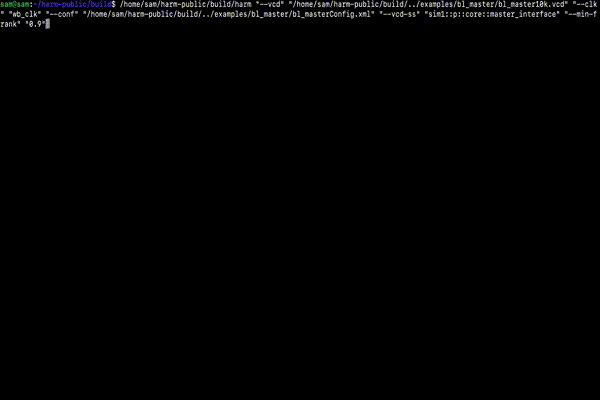

## HARM

The official repo of the Hint-Based AsseRtion Miner


  

## Table of contents

- [Project info](#project-info)
- [Quick start](#quick-start)
  - [Dependencies](#dependencies)
  - [Build the project](#build-the-project)
  - [Run default tests](#run-default-tests)
- [How to use the miner](#how-to-use-the-miner)
  - [Run with a vcd trace](#run-with-a-vcd-trace)
  - [Run with a csv trace](#run-with-a-csv-trace)
  - [Notes on input interpretation](#notes-on-input-interpretation)
  - [Automatically generating a configuration file](#automatically-generating-a-configuration-file)
- [The configuration file](#the-configuration-file)
  - [1. Proposition (`<prop>`)](#1-proposition-prop)
  - [2. Numerics (`<numeric>`)](#2-numerics-numeric)
  - [3. Domains](#3-domains)
  - [4. Template (`<template>`)](#4-template-template)
    - [Decision Tree Operators](#decision-tree-operators-dtos)
    - [SystemVerilog features](#systemverilog-features)
    - [Metric](#metric)
  - [Editing Rules Configuration](#editing-rules-configuration)
- [How to check an assertion](#how-to-check-an-assertion)
- [Optional Arguments](#optional-arguments)
  - [Logging Flags](#logging-flags)
  - [Trace Configuration](#trace-configuration)
  - [Assertions & Ranking](#assertions--ranking)
  - [Dumping](#dumping)
  - [Fault Analysis](#fault-analysis)
  - [Miscellaneous](#miscellaneous)
- [Docker](#docker)
- [Citations](#citations)

## Project info

HARM (Hint-based AsseRtion Miner) is a tool to generate Linear Temporal Logic (LTL) assertions starting from a set of user-defined hints and the simulation traces of the design under verification (DUV). The tool is agnostic with respect to the design from which the trace was generated, thus the DUV source code is not necessary. The user-defined hints involve LTL templates, propositions and ranking metrics that are exploited by the assertion miner to reduce the search space and improve the quality of the generated assertions. This way, the tool supports the work of the verification engineer by including his/her insights in the process of automatically generating assertions.




# Quick start

For now, we support only Linux and Mac OS (both x86 and arm64) with gcc and clang (c++17) and cmake 3.30+.

## Dependencies
* [spotLTL](https://spot.lrde.epita.fr/install.html)
* [antlr4-runtime](https://www.antlr.org)
* [boost 1.83+](https://boostorg.jfrog.io/artifactory/main/release/1.83.0/source/)

  

* Install all the dependencies manually or simply run the commands below.

### Ubuntu
```
sudo apt-get install -y uuid-dev pkg-config
```

### Third party
* Install all dependencies. All these dependencies will be compiled from source.
* This will not dirty your system, as all the dependencies will be installed in the third\_party directory.

```
cd third_party
bash install_all.sh
```


## Build the project

Create a build directory.
```
mkdir build && cd build
```

Run cmake.

```
cmake -DCMAKE_BUILD_TYPE=Release ..
```

Build all targets: harm and tests.
```
make
```

### Mac OS only
* Install the libraries (specify a proper path using cmake) 
```
make install
```
* Add the libraries to the runtime library path
```
export DYLD_LIBRARY_PATH=<path_to_install_directory>/harm/lib:$DYLD_LIBRARY_PATH
```

## Run default tests

```
ctest -V -R
```


# How to use the miner  
HARM has two main inputs, a trace in the form of a vcd/csv file and a set of hints.
Hints consist of a set of propositions, templates and metrics; they are defined in a separate xml configuration file. 
The user can find several working examples in the "examples" directory.

## Run with a vcd trace

```
./harm --vcd trace.vcd --clk clock --conf config.xml
```

* clock is the signal used to sample time (every posedge).
* config.xml is the configuration file containing propositions and templates.
* Use --vcd-dir <DIRECTORY> to give as input a set of .vcd traces
* IMPORTANT: see the options --vcd-ss and --vcd-r to make harm capture the correct VCD scope and signals

## Run with a csv trace

```
./harm --csv trace.csv --conf config.xml
```
* Use --csv-dir <DIRECTORY> to give as input a set of .csv traces
* Note that you do not have to specify a clock signal when using a csv file, as each row is already considered a clock event.
* A CSV trace must contain the declaration of the design's variables in the first row, following a C/Verilog style.
	
Example of a valid csv file:
```
int var1, bool var2, float var3, logic [3:0] var4
23, 1, 34.7, xxxz
34, 0, 99.912, 0101
```


## Notes on input interpretation

### Supported Variable Types
Harm supports a comprehensive list of **C** and **SystemVerilog (SV)** variable types:

* **C Integers:** `bool`, `char`, `short`, `int`, `long int`
* **C Fixed-Width & Unsigned:** `int32_t`, `int64_t`, `uint32_t`, `uint64_t`, `size_t`, `unsigned {char|short|int|long int}`
* **Floating Point:** `float`, `double`, `shortreal`, `real`, `realtime`
* **SystemVerilog Integers:** `byte`, `shortint`, `int`, `longint`, `integer`, `time` (including `signed`/`unsigned` variants)
* **SystemVerilog Logic/Net:** `bit`, `reg`, `logic`, `wire` (including `signed` variants)

### Value Interpretation Rules
When reading traces, Harm interprets input values based on the variable type:

* **Base 10:** Used for all C integer types and SV 2-value integers.
* **Base 2:** Used for SV 4-value bit-vectors (e.g., `wire`, `reg`, `logic`, `int`).

> **Note:** For both C and SV types, if a type is explicitly **signed**, the input value is treated as a 2's complement integer.

### Formatting Binary Inputs (Base 2)
When providing binary inputs, leading zeros (left-padding) are **optional** for unsigned values or positive signed values. However, they are **mandatory** for negative signed values.

**Example:**
For a variable declared as: `logic signed [7:0] v1`

| Desired Value | Input Format | Interpretation |
| :--- | :--- | :--- |
| **4** (Positive) | `100` | Pads to `00000100` (Decimal 4) |
| **-3** (Negative) | `11111101` | **Must provide full binary representation.** Treated as 2's complement. |

Harm will always output base 2 values without leading zeros.


	
## Automatically generating a configuration file
To simplify the creation of a new test, HARM is capable of generating a sample configuration file using the variables found in the trace. The user might want to modify the generated configuration file to adapt it to her/his needs.

For vcd:
```
./harm --vcd trace.vcd --clk clock --conf path/to/newConfig.xml --generate-config
```
For csv:
```
./harm --csv trace.csv --conf path/to/newConfig.xml --generate-config
```

 HARM will create the configuration file on the path given as an argument.

# The configuration file

> **Recommendation:** Always start from an automatically generated configuration file using the `--generate-config` option.

The configuration file is organized into **contexts**. Each context groups related hints, which primarily consist of propositions, templates, and metrics.

### XML Structure Example
```xml
<harm>
    <context name="c1">
        <prop exp="var1 && var2" loc="dt"/>
        <prop exp="var3 + var4 > 100" loc="dt"/>
        <prop exp="!var5 || !var6" loc="c"/>
        <prop exp="var10" loc="c"/>
        <prop exp="var11" loc="c"/>
        
        <numeric clustering="K,10Max,0.01WCSS,><,==,>=,<=" exp="var12" loc="c"/>
        <numeric clustering="K,10Max,0.01WCSS,==" exp="var13" loc="[dt]"/>
        <numeric clustering="K,10Max,0.01WCSS,><,==,>=,<=" exp="var7 + var8" loc="a"/>
        
        <template dtLimits="4A,3D,2D,-0.1E,U,O" exp="G({..#1&..}|-> X(P0))" />
        <template dtLimits="4A,3D,2D,-0.1E,U,O" exp="G({..#1&..}|-> X(P0))" />
        
        <edit rewrite="G({@(..##..,f) ##@(N,n1) @(P,s)}|->{##@(N,n2) @(P,t)})" 
              to="G({@(f)}|->{##@(n1+n2) @(t)})" 
              constraint='(s=="true" || s=="1") && n1!=2' />
        <edit remove="G({@(P,a)}|->{@(P,b)})" constraint="a==b" />

        <filter name="causality" exp="1-afct/traceLength" threshold="0.45"/>
        <sort name="pRepetitions" exp="1/(pRepetitions*2+1)" />
        <sort name="frequency" exp="atct/traceLength"/>
    </context>
</harm>
```
## 1. Proposition (`<prop>`)
Propositions are non-temporal boolean expressions defined in the `exp` attribute. They are used to fill placeholders in templates, while metrics are used to perform the final ranking of assertions.

### Data Types & Internal Representation
Harm supports standard C/C++ operators (boolean, relational, arithmetic, bitwise, string).

* **Integers:** C/C++ integer types are represented as **64-bit C integers** (signed or unsigned).
* **Logic/Net:** Verilog types (e.g., `reg`, `wire`, `logic`) are represented as **4-value bit vectors** (0, 1, x, z) with a max width of **511 bits**.
* **Floats:** All float types are internally represented as **C doubles**.

> **Note:** All operators available for integer types are also supported for logic types. For the full grammar, refer to `src/antl4/propositionParser/grammar/proposition.g4`.

### ⚠️ Important Warnings

> **VCD Traces & Hierarchies**
> If you are using a VCD trace, variables must include their full hierarchical path prefix.
> * *Example:* `test1::modn::a` refers to variable `a` inside module `modn`, instantiated in `test1`.
> * Check your VCD file to retrieve the exact path.

> **Type Conversions**
> When constructing expressions with mixed types (e.g., `char` and `int`, or `size_t` and `logic`), standard **C/Verilog implicit type conversion rules** apply (including overflow/underflow behavior).
> * See [C implicit conversion rules](https://en.cppreference.com/w/c/language/conversion) for details.

---

## 2. Numerics (`<numeric>`)
The `<numeric>` element allows you to automatically generate propositions using clustering algorithms. Harm can generate predicates over arithmetic expressions (e.g., `c == expression`, `c_min <= expression <= c_max`).

### Configuration Attributes
* `exp`: Specifies the numeric expression to analyze (supports `int`, `logic`, or `double`).
* `clustering`: A comma-separated list of options to customize the generation process.

### Clustering Options
| Option | Description |
| :--- | :--- |
| **K** | Use the **K-means** algorithm. |
| **C** | Use an algorithm to generate all **contiguous subsequences** of integer/logic data. |
| **\<N\>E** | **Exclude** the value `<N>` from clustering. Can be used multiple times.<br>_Note: `<N>` must be a base-10 integer or float._ |
| **\<N\>Max** | Keep only the **top N** generated propositions (ranked by support). |
| **\<F\>WCSS** | **Elbow Method:** Stop K-means when variance reduction drops below `<F>` (float between 0-1). |
| **==** | Generate propositions of the form: `<numeric-exp> == c` |
| **>=** | Generate propositions of the form: `<numeric-exp> >= c` |
| **<=** | Generate propositions of the form: `<numeric-exp> <= c` |
| **><** | Generate propositions of the form: `min <= <numeric-exp> <= max` |

> **Note:** When using the **C** (contiguous) option, propositions use the `SetMembership` operator instead of `>=` and `<=` to improve readability.

### Reference
For a detailed explanation of the clustering procedure in Harm, please refer to:
> S. Germiniani and G. Pravadelli, **"Exploiting clustering and decision-tree algorithms to mine LTL assertions containing non-boolean expressions,"** *2022 IFIP/IEEE 30th International Conference on Very Large Scale Integration (VLSI-SoC)*, Patras, Greece, 2022. [DOI: 10.1109/VLSI-SoC54400.2022.9939640](https://doi.org/10.1109/VLSI-SoC54400.2022.9939640)

## 3. Domains
HARM allows the definition of **"domains"** to restrict which propositions (or numerics) can be inserted into specific placeholders.
* **Assignment:** Use the `loc` attribute in `<prop>` or `<numeric>` tags.
* **Multiple Domains:** A single proposition can belong to multiple domains.
* **Default Behavior:** If the `loc` attribute is omitted, the proposition is available in **all** global domains.

### Global Domains
There are 4 reserved global domains:

| Domain | Description |
| :--- | :--- |
| **`a`** | Used only to fill placeholders in the **antecedent** (excluding decision tree operators). |
| **`c`** | Used only to fill placeholders in the **consequent**. |
| **`ac`** | Used in placeholders appearing in **both** the antecedent and the consequent. |
| **`dt`** | Used only to fill **Decision Tree (DT) operators**. |

### Local Domains
You can define custom "local" domains using **unsigned integers** as IDs in the `loc` attribute (e.g., `loc="1"`, `loc="1,2"`). These IDs can be referenced in template placeholders to narrow the search space.

### Advanced: Numerics in Decision Trees
By default, numerics are processed using a clustering algorithm on the **entire trace**. However, when using DT operators, you can delegate the generation process to the DT algorithm (which selects specific parts of the trace). This behavior is controlled by square brackets `[]`.

| Syntax | Behavior |
| :--- | :--- |
| `loc="1"` | **Pre-generation:** Harm generates propositions using the *entire trace*. The results are assigned to domain `1`. |
| `loc="[1]"` | **Delegation:** The numeric is passed raw to the Decision Tree algorithm. It is used only in DT operators containing domain `1`. |
| `loc="[dt]"` | **Global Delegation:** The numeric is used in **all** DT operators. |

---

## 4. Template (`<template>`)
Templates define the structural patterns for mining assertions. They follow the form `G(antecedent -> consequent)` and support most LTL/SVA operators (PSL, SpotLTL, and mixed cases).

* **Placeholders:** Variables in the form `P<N>` (e.g., `P0`, `P1`).
* **Domain Restriction:** Placeholders can specify allowed domains using `P<N>(id1, ...)` to restrict which propositions fill them.
    * *Example:* `G(P0 && P1 -> P2 W P3)` has 4 placeholders.
    * *Example:* `P0(1, c)` accepts propositions from local domain `1` or global domain `c`.

> **Grammar Reference:** For the full grammar, check `src/antlr4/temporalParser/grammarTemporal/temporal.g4`.

### Decision Tree Operators (DTOs)
There are three special placeholders that invoke a DT algorithm to synthesize complex expressions. These can only be used **once** in the antecedent.

| Operator | Function | Example Expansion |
| :--- | :--- | :--- |
| `..&&..` | Synthesizes a conjunction. | `v1 && v2 && ... && vn` |
| `..##1..` | Synthesizes a sequence with delay 1. | `v1 ##1 v2 ... ##1 vn` |
| `..#1&..` | Synthesizes a sequence of conjunctions. | `(A && B) ##1 (C && D)` |

> **Note:** DTOs also support domain restrictions, e.g., `..&&..(id1, id2)`.

### DTO Configuration (`dtLimits`)
Templates using DTOs may specify a `dtLimits` attribute to configure the decision-tree algorithm. The parameters are comma-separated (e.g., `dtLimits="4A,3D,U"`).

#### Structural Limits
| Param | Description |
| :--- | :--- |
| **`<N>`A** | **Max Operands:** The maximum number of atomic propositions to add. |
| **`<N>`D** | **Max Temporal Depth:** The maximum number of temporal operands (delays) to add. |
| **`<N>`W** | **Max Width:** The maximum number of propositions to add at a specific depth level. |

#### Search Strategy & Heuristics
| Param | Description |
| :--- | :--- |
| **S** | **Sequential:** Constructs expressions in strict order (e.g. `i3 ##1 i2 ##1 i1` → `o1`). |
| **U** | **Unordered:** Can add operands in any order. |
| **COV** | **Coverage:** Use a coverage-based heuristic to split the dataset. |
| **ENT** | **Entropy:** Use an entropy-based heuristic to split the dataset. |

#### Effort & Constraints
| Param | Description |
| :--- | :--- |
| **`<F>`E** | **Computational Effort:** Controls how many candidates are selected to split the search space.<br>• **E < 0:** Minimal effort, keeps only the best candidate.<br>• **E = 0:** Use all best candidates (tied score).<br>• **0 < E <= 1:** Use top `E` percent of candidates.<br>• **E > 1:** Use top `N` candidates. |
| **O** | **Offset:** Returns assertions obtained by negating the consequent of a generic implication that is false whenever the antecedent is true. |
| **!N** | **No Negation:** Prevent the DT from generating negated propositions (Default: Enabled). |
| **PF** | **Perfect Fit:** Force `ATCF == 0` in every split. Reduces quantity but increases quality (Default: Disabled). |
| **DRP** | **Don't Reuse Props:** Prevent reusing the same proposition multiple times in a path. |
| **DRN** | **Don't Reuse Numerics:** Prevent reusing the same numeric multiple times in a path. |
| **DR** | **Don't Reuse:** Enables both `DRP` and `DRN`. |
  
### SystemVerilog features

#### Set Membership
Harm supports the standard SystemVerilog (SVA) set membership operator:

```systemverilog
<exp> inside { <numeric_range>, <numeric>, ... }
```

**Syntax:**
* **Ranges:** Defined using square brackets `[<min>:<max>]`.
* **Operands:** `<numeric>` can be any integer or logic expression.


* **Open Ranges:** The `$` token can be used to specify the minimum or maximum limit of the variable type (e.g., `[0:$]` represents 0 to max).
* **Behavior:** The expression evaluates to `true` if `<exp>` is contained within the set defined by `{...}`.


#### Functions
Harm supports the use of standard SystemVerilog Assertion system functions in both the **propositional layer** (inside propositions and numerics) and the **temporal layer** (inside templates).

| Function | Description |
| :--- | :--- |
| `$stable(<exp>)` | Returns true if the expression has not changed from the previous cycle. |
| `$rose(<exp>)` | Returns true if the expression changed from 0 to 1 (rising edge). |
| `$fell(<exp>)` | Returns true if the expression changed from 1 to 0 (falling edge). |
| `$past(<exp>, <uint>)` | Returns the value of the expression `<uint>` cycles ago. |

**Layer Constraints:**
* **Temporal Layer:** The `<exp>` must be a single placeholder (e.g., `P0`) or a complete boolean proposition.
* **Propositional Layer:** The `<exp>` can be any boolean or logic expression.
    * *Note:* The `$past` function also supports float types in this layer.

#### Metric
A metric is a numeric formula that measures the impact of specific assertion features. Metrics determine the final ranking of assertions and can be used in two ways:

1.  **Filtering:** Associated with a `threshold`. Assertions scoring below this threshold are strictly discarded.
2.  **Sorting:** Used to calculate an overall score to rank the remaining assertions.

**Available Assertion Features**
The following variables can be used to construct metric formulas.

**1. Contingency Table Metrics**
These variables represent the number of time units where specific conditions hold regarding the Antecedent (A) and Consequent (C).

| Variable | Condition (Antecedent $\rightarrow$ Consequent) |
| :--- | :--- |
| **atct** | Antecedent **True** $\rightarrow$ Consequent **True** |
| **afct** | Antecedent **False** $\rightarrow$ Consequent **True** |
| **auct** | Antecedent **Unknown** $\rightarrow$ Consequent **True** |
| **atcf** | Antecedent **True** $\rightarrow$ Consequent **False** |
| **afcf** | Antecedent **False** $\rightarrow$ Consequent **False** |
| **aucf** | Antecedent **Unknown** $\rightarrow$ Consequent **False** |
| **atcu** | Antecedent **True** $\rightarrow$ Consequent **Unknown** |
| **afcu** | Antecedent **False** $\rightarrow$ Consequent **Unknown** |
| **aucu** | Antecedent **Unknown** $\rightarrow$ Consequent **Unknown** |
| **ct** | Total time units where Consequent is **True** |

**2. Trace & Complexity Metrics**
* **`traceLength`**: Total length of the trace (sum of lengths if multiple input traces are used).
* **`complexity`**: The number of variables used in the assertion.
* **`pRepetition`**: The number of repeated propositions in the assertion.

**3. Fault Analysis Metrics**
* **`faultCoverage`**: Number of faults covered by the assertion.
* **`nfCovered`**: Alias for `faultCoverage`.
* **`nFaults`**: Total number of faulty traces provided as input.

## Editing Rules Configuration

Users can define assertion editing rules using the `<edit>` tag. These rules allow for the automated removal or rewriting of mined assertions based on pattern matching.

### Rule Attributes
The `<edit>` tag supports two primary attributes:

* **`remove`**: Defines a pattern to identify assertions that should be directly discarded.
* **`rewrite`**: Defines a pattern to identify assertions to be modified. This must be paired with the `to` attribute, which defines the new structure of the assertion.

### Pattern Matching Syntax
The matching logic relies on the `@` operator. This operator ignores spaces when matching assertions.

#### 1. The `@` Operator
All propositions within a rule must be matched using this operator. It is used in two forms:
* **Match only:** `@(<type>)` matches a specific expression type.
* **Match and Capture:** `@(<type>, <var>)` matches the type and stores the resulting string in a variable named `<var>`.

#### 2. Supported Expression Types
You can match specific expression categories using the following type codes:

| Type Code | Description | Example Context |
| :--- | :--- | :--- |
| **P** | Propositions | `@(P)` matches a boolean proposition. |
| **N** | Unsigned Integers | `@(N)` matches a numeric value. |
| **..##..** | DT Operator Expressions | `@(..##..)` Matches expressions of the form p_1 \#\#1 p_2 ... \#\#1 p_n. |

---

### Rewriting and Constraints

When using the `rewrite` attribute, captured variables can be manipulated to generate a new valid assertion.

#### Variable Usage in `to` Rules
* **Standard Rewrite:** Variables captured in the `rewrite` rule are inserted into the `to` string using `@(<var>)`.
* **Arithmetic Operations:** Variables captured as type **N** (Numeric) can be used in arithmetic expressions.
    * Supported operators: $+$, $-$, $*$, $/$.
    * *Example:* If `n1` and `n2` are numeric variables, `@(n1+n2)` will generate a string representing the sum of their values.

#### Defining Constraints
Both `remove` and `rewrite` rules accept an optional `constraint` attribute. This is a boolean expression that must evaluate to **true** for the rule to apply.

**Data Types in Constraints:**
* **Type N:** Treated as **Unsigned Integers** (allows arithmetic).
* **Type P or ..##..:** Treated as **Strings**.

**String Operations:**
* **Equality:** `<var> == "<stringConstant>"`
* **Concatenation:** `<string> + <string>`
* **Substring:** `<string>.substr(index, length)` (follows C/C++ semantics).

---

### Example

The following example demonstrates a rule that rewrites an assertion based on specific conditions.

**The Rule:**
```xml
<edit 
    rewrite="G({@(..##.., f) ##@(N, n1) @(P, s)} |-> {##@(N, n2) @(P, t)})" 
    to="G({@(f)} |-> {##@(n1+n2) @(t)})" 
    constraint='(s == "true" || s == "1") && n1 != 2' 
/>
```

**Breakdown:**

1. **Capture:**
* `f` captures a DT expression.
* `n1` and `n2` capture integers.
* `s` and `t` capture propositions.


2. **Constraint Check:**
* The rule only applies if the string `s` is "true" OR "1".
* AND if the integer `n1` is not equal to 2.


3. **Output Generation (`to`):**
* It reconstructs the assertion using `f` and `t`.
* It calculates the sum of  and inserts the result into the new temporal operator.

- If the above rewrite rule is applied to assertion G({p1 ##1 p2 ##1 true} |-> {##3 p3}), the resulting assertion becomes G({p1 ##1 p2} |-> {##4 p3}).

#  How to check an assertion
The template expression has an additional parameter "check", if it is set to "1" then the miner analyses the corresponding assertion on the given trace, if the assertion does not hold on the input traces, it reports the cause of failure. Example:
```
<template check="1" exp="G({v1} |-> {(v2<10 && v3) && (v4==8 && v5)})" />
``` 
Note that the template must be fully instantiated (no placeholders).
 
# Optional Arguments

### Logging Flags
| Flag | Description |
| :--- | :--- |
| `--help` | Show options. |
| `--isilent` | Disable all **info** messages. |
| `--psilent` | Disable all **progress bars**. |
| `--silent` | Disable **all** outputs. |
| `--wsilent` | Disable all **warnings**. |

#### Logging Details
Harm produces three main types of textual outputs:
* **INFO:** Reports execution information (Black color; execution continues).
* **WARNING:** Reports potential errors (Yellow color; execution continues).
* **ERROR:** Reports critical errors (Red color; execution halts).

> **Note:** Warnings and Errors are automatically appended in JSON format to `warning.log` and `error.log`. Do not manually edit these files.

---

### Trace Configuration
* **`--reset <String>`**
    Defines a propositional expression `pr` to represent a reset in a trace. Harm will not mine assertions where the behavior starts before the reset activates (`pr` is true) or ends after the reset becomes inactive (`pr` is false).

* **`--vcd-ss <string>`**
    Specify a scope of signals in the `.vcd` traces.
    * *Format:* `root_scope::sub_scope::sub_sub_scope::...::signal`

* **`--vcd-r=<uint>`**
    Recursively add signals for sub-scopes.
    * *Default:* Max depth of VCD.
    * **WARNING:** Signals in sub-scopes (relative to the root) require a scope prefix in the configuration file (and in the clock signal specified with `--clk`). If `--vcd-ss` is used, that scope becomes the root.

* **`--vcd-unroll=<uint>`**
    Create a context for each scope when generating the config file.
    * *Default:* Max depth.
    * *Constraint:* Mutually exclusive with `vcd-r`.

* **`--split-logic`**
    Generate a config file where all bivectors are split into single-bit variables. Must be used with `--generate-config`.

* **`--force-int`**
    Force all logic variable types to be treated as integers (`x` and `z` values will be treated as 0).

---

### Assertions & Ranking
* **`--max-ass <uint>`**
    The maximum number of assertions to keep after ranking.

* **`--min-frank <float>`**
    Minimum final ranking score (0.0 to 1.0). All assertions below this level are discarded.

* **`--keep-vac-ass <FILE>`**
    Do not discard vacuous assertions.

* **`--include-ass <FILE>`**
    Create a new context named `external` populated with assertions from the provided FILE (one per line). If an `external` context already exists in the config, assertions are appended to it.

* **`--sample-by-con`**
    If the number of mined assertions exceeds `--max-ass`, select assertions by favoring consequent diversity.

* **`--interactive`**
    Enable interactive assertion ranking.

* **`--print-logic-as-int`**
    Logic constants are printed in integer format rather than binary (`x` and `z` bits treated as 0).

* **`--dont-normalize`**
    Print assertions with non-normalized ranking metrics.

#### Output Formats
* **`--sva`**: SystemVerilog Assertion format.
* **`--sva-assert`**: Simulable SVA format: `assert property( (posedge <input_clk>) <assertion> )`.
* **`--psl`**: PSL format.
* **`--spotltl`**: Spot LTL format.

---

### Dumping
* **`--dump-to <PATH>`**
    Dump assertions to a file or directory.
    * If `<PATH>` is a **Directory**: Each context is dumped to a separate file within it.
    * If `<PATH>` is a **File**: All assertions are dumped to this single file.

* **`--dump-stat`**
    Dump mining statistics to file.

* **`--dump-vac-ass <FILE>`**
    Dump vacuous assertions to file.

* **`--ddd <DIRECTORY>`**
    Dump debug data (useful for understanding internal generation).

* **`--check-dump-eval <DIRECTORY>`**
    For each `check` assertion, dump the evaluation of the antecedent, consequent, and shift on input traces (each assertion gets a unique file).

---

### Fault Analysis
* **`--fd <DIRECTORY>`**
    Path to the directory containing faulty traces (for fault coverage).

* **`--find-min-subset`**
    Find the minimum number of assertions covering all faults (must be used with `--fd`).

---

### Miscellaneous
* **`--max-threads <uint>`**
    Max number of threads HARM is allowed to spawn.

* **`--name <String>`**
    Name of this execution (used when dumping statistics).


# Docker

Download the docker image:
```
docker pull samger/harm:latest
```

Run it:
```
docker run -it samger/harm:latest
```

# Citations
If you need to reference HARM in an academic publication, refer to the following paper:
```
S. Germiniani and G. Pravadelli, "HARM: A Hint-Based Assertion Miner," in IEEE Transactions on Computer-Aided Design of Integrated Circuits and Systems, vol. 41, no. 11, pp. 4277-4288, Nov. 2022, doi: 10.1109/TCAD.2022.3197525.
```

